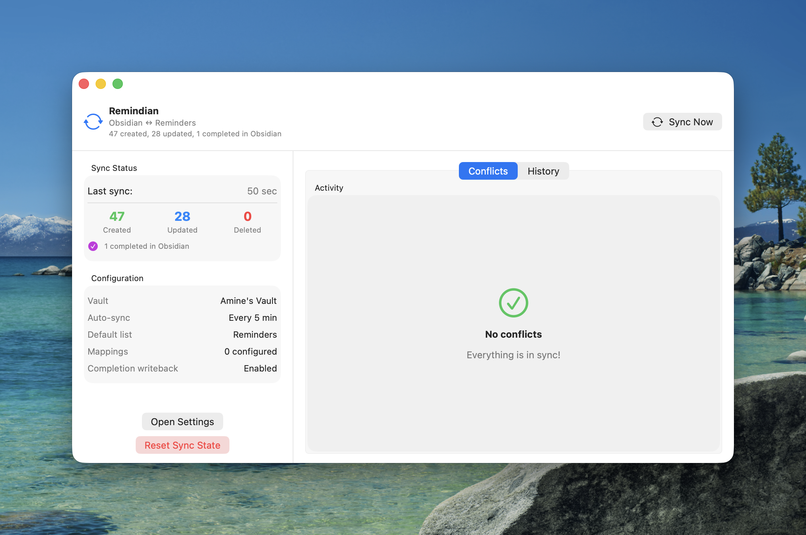

# Remindian

A native macOS menu-bar app that syncs tasks between your [Obsidian](https://obsidian.md) vault (using the [Tasks plugin](https://publish.obsidian.md/tasks/Introduction) format) and Apple Reminders.

**Obsidian is the source of truth.** Tasks flow from Obsidian into Apple Reminders. Completion status, due dates, start dates, and priority can optionally be written back to Obsidian using surgical, metadata-preserving edits.



## Download

**[Download the latest beta](https://github.com/Santofer/Remindian/releases/latest)** — macOS 13.0+ (Ventura or later)

> Since the app is not notarized, right-click the app and select **Open** on first launch to bypass Gatekeeper.

## Features

- **Two-way sync** — Tasks flow from Obsidian to Reminders; completions, due dates, start dates, and priority changes sync back
- **Surgical file edits** — Never reconstructs task lines; preserves recurrence markers, tags, and all metadata
- **Recurrence support** — Completes recurring tasks and creates the next occurrence automatically
- **Tag-based list mapping** — `#work` tasks go to your "Work" list, `#personal` to "Personal", etc.
- **Folder filtering** — Whitelist specific folders to scan, or exclude folders you don't want synced
- **Cross-file deduplication** — Detects duplicate tasks across files and syncs only one copy
- **New task writeback** — Tasks created in Reminders can be written back to an Obsidian inbox file
- **Real-time sync** — Optional file watcher triggers sync on vault changes (or use timer-based polling)
- **Dry run mode** — Preview what would change without making any actual modifications
- **Automatic backups** — Every Obsidian file is backed up before modification
- **Onboarding wizard** — Guided setup for vault path, folder filtering, and tag mappings on first launch
- **macOS native** — Built with SwiftUI, runs in the menu bar, no external dependencies

## Quick Start

1. **Download** the DMG from the [latest release](https://github.com/Santofer/Remindian/releases/latest)
2. **Drag** Remindian to your Applications folder
3. **Right-click → Open** on first launch (required for unsigned apps)
4. **Follow** the onboarding wizard to select your vault, grant Reminders access, and configure folder filtering and tag mappings
5. Tasks will start syncing automatically

## Configuration

Open **Settings** from the menu bar icon to configure:

- **General** — Vault path, sync interval, writeback toggles, notifications, default list
- **List Mappings** — Map Obsidian `#tags` to specific Reminders lists
- **Advanced** — Folder whitelist/exclusions, dry run mode, sync state reset, backup access

## How It Works

Remindian scans your Obsidian vault for tasks in the [Tasks plugin](https://publish.obsidian.md/tasks/Introduction) format:

```markdown
- [ ] My task ⏫ 🛫 2024-01-15 📅 2024-01-20 #work
- [x] Completed task 📅 2024-01-10 ✅ 2024-01-09
- [ ] Recurring task 🔁 every week 📅 2024-03-01
```

Each task is synced to Apple Reminders with its due date, priority, and tags. When you complete a task in Reminders, the completion is written back to Obsidian as a surgical edit — only the checkbox and completion date are modified, preserving all other metadata.

## Build from Source

```bash
git clone https://github.com/Santofer/Remindian.git
cd Remindian
open ObsidianRemindersSync.xcodeproj
```

**Requirements:** macOS 13.0+, Xcode 15.0+

## Transparency

AI (Claude) was used as a development tool during the creation of this app. The code has been reviewed, tested on real data, and the full source is open for anyone to audit. The app is sandboxed, creates automatic backups before every file modification, and includes a dry run mode for safe testing.

## License

[MIT License](LICENSE) — Made by **Santofer**.

See [CHANGELOG.md](CHANGELOG.md) for detailed version history and technical documentation.

See [CONTRIBUTING.md](CONTRIBUTING.md) for contribution guidelines.
